# Loan Portfolio Insights with MongoDB Atlas & n8n

---

> _This guide is written for architects, data engineers, and full-stack developers who want to understand **how MongoDB Atlas powers an agentic AI application** using a loan-portfolio domain._

---

## 1. Overview

### Solution Context

To achieve a true Customer 360 view—data is fragmented across isolated systems (origination, servicing, risk, communications), making it difficult to unify and search information semantically. Traditional datastores further separate OLTP and vector workloads, preventing seamless exploration and enrichment. MongoDB Atlas enables a single, flexible document store with built-in vector search and hybrid search, empowering teams to deliver rich, AI-powered insights across the entire customer lifecycle.

### High-level architecture


### Repositories / Key files

| Folder/File | Purpose |
|-------------|---------|
| `src/app/lib/types.ts` | _Single source of truth_ for TypeScript loan schema |
| `src/app/lib/seed-data.ts` | ETL+enrichment logic: generates realistic loans, analyst notes, embeddings |
| `src/app/lib/agent.ts` | LangGraph workflow + 7 domain tools backed by MongoDB queries |
| `package.json` | Dependencies: `@langchain/*`, `mongodb 6.x`, `next 15`, `react 19`, etc. |

---

## 2. 🔄 Data Ingestion Pipeline

### 2.1 Source Systems

The demo simulates **five canonical sources**:

1. **Loan Origination System (LOS)** – applicant KYC, requested amount, purpose
2. **Loan Management System (LMS)** – repayment schedule & live status
3. **Customer Communication Logs** – call center notes, emails, WhatsApp interactions
4. **Payment History** – monthly on-time / delayed / default flags
5. **Risk Engines** – debt-to-income, credit bureau scores, internal risk factors

In production these arrive as JSON events (Kafka, webhooks, SFTP dumps). For demo we synthesise them via an LLM to guarantee realism.

### 2.2 Unified Loan Schema (`types.ts`)
>
> File excerpt ↓

```typescript
export type LoanApplication = {
  application_id: string;
  applicant_details: {
    name: string;
    age: number;
    occupation: string;
    monthly_income: number;
    existing_loans: number;
    credit_score: number;
    sector: string;
    years_of_experience: number;
  };
  loan_details: {
    amount: number;
    tenure: number;
    interest_rate: number;
    purpose: string;
    category: 'personal' | 'business' | 'home_improvement';
    emi_amount: number;
  };
  risk_metrics: {
    debt_to_income: number;
    payment_to_income: number;
    existing_emi_ratio: number;
    risk_score: number;
  };
  application_status: 'approved' | 'rejected' | 'pending';
  performance_data: {
    payment_history: Array<{ month:number; status:'on_time'|'delayed'|'default'; payment_date:Date; amount_paid:number }>;
    current_status: 'active' | 'closed' | 'defaulted';
  };
  metadata: {
    submission_date: Date;
    processing_time: number;
    analyst_notes: string;
    last_updated: Date;
    vector_embedding?: number[]; // ✨ Atlas Vector Search field
  };
}
```

**Why MongoDB?**

* Document model fits nested sub-objects (`applicant_details`, `payment_history`) with no joins.
* Fields can evolve independently (flexible schema) – e.g. adding `mitigating_factors[]` later.

### 2.3 ➡️ Data Ingestion - Current Sample Data


### 2.4 Example Persisted Document

```jsonc
{
  "_id": "666faa...",
  "applicant_details": {
    "name": "Ananya Iyer",
    "occupation": "Software Eng @ Infosys",
    "sector": "IT",
    "monthly_income": 120000
  },
  "loan_details": {
    "amount": 750000,
    "interest_rate": 11.25,
    "category": "personal"
  },
  "risk_metrics": { "risk_score": 4.7 },
  "application_status": "approved",
  "performance_data": { "current_status": "active" },
  "metadata": {
    "analyst_notes": "Applicant's DTI comfortable...",
    "vector_embedding": [-0.0123, 0.081, ... ]
  }
}
```

---

## 3. 📝 Analyst Notes Generation

### 3.1 Prompt Engineering

`seed-data.ts › generateAnalystNotes()` crafts a **role-tailored prompt**:

```text
As a loan analyst, write detailed notes for the following loan application:
Applicant: {{name}}
Occupation: {{occupation}} at {{company}}
Loan Amount: ₹{{amount}}
Purpose: {{detailed_purpose}}
Risk Score: {{risk_score}}

Include:
1. Key strengths and concerns
2. Analysis of repayment capacity
3. Evaluation of purpose and amount justification
4. Overall recommendation
```

* Uses Indian Rupee symbol, domain-specific language.
* Temperature=0.8 → diverse but factual narratives.

### 3.2 Storage Strategy

The resulting paragraph (≈150–200 words) is persisted under `metadata.analyst_notes` _in the same document_. This co-location enables **hybrid search** (vector + metadata filters) without joins.

### 3.3 Impact

* Human bankers can review LLM-generated rationale.
* Vector embedding (§4) turns unstructured prose into semantic search keys for the agent.

---

## 4. 🧠 Embeddings & Vector Storage

### 4.1 Embedding Generation

```typescript
const embeddings = new OpenAIEmbeddings({ modelName: 'text-embedding-3-small' })
const embedding = await embeddings.embedQuery(analystNotes) // returns number[1536]
loanData.metadata.vector_embedding = embedding
```

* You can **swap** `OpenAIEmbeddings` with **VoyageAI** for domain-tuned representations:

```typescript
import { VoyageEmbeddings } from '@langchain/community/embeddings/voyage'
const embeddings = new VoyageEmbeddings({ modelName:'voyage-2', apiKey:process.env.VOYAGE_API })
```

> VoyageAI is noted for finance-oriented semantic nuance.

### 4.2 Creating the Atlas Vector Index

```bash
mongosh <<'EOF'
use loan_portfolio
db.loan_applications_demo.createVectorSearchIndex({
  name: 'vector_index',
  definition: {
    fields: [{
      type: 'vector',
      path: 'metadata.vector_embedding',
      numDimensions: 1536,
      similarity: 'cosine'
    }]
  }
})
EOF
```

* **Similarity options**: `cosine` | `euclidean` | `dotProduct`
* **Vector quantization** can be enabled for memory-efficient HNSW graphs.
  See [_Atlas Vector Quantization_](https://www.mongodb.com/docs/atlas/atlas-vector-search/vector-quantization/).

### 4.3 Hybrid & Metadata Filtering

```javascript
const vectorResults = await collection.aggregate([
  {
    $vectorSearch: {
      index: 'vector_index',
      queryVector: embedding,
      path: 'metadata.vector_embedding',
      k: 10,
      filter: { 'loan_details.category': 'business', 'risk_metrics.risk_score': { $lte: 6 } }
    }
  }
])
```

* Combines semantic proximity with **exact match** facets.
* Supported in v7.2+ clusters across AWS, Azure, GCP.

---

## 5. 🤖 Agentic Exploration Workflow (`agent.ts`)

`src/app/lib/agent.ts` wires **LangGraph** state machine & **seven domain tools** that tap MongoDB.

### 5.1 Available Tools

| Tool | Purpose | Underlying Mongo Query |
|------|---------|------------------------|
| `portfolio_metrics` | Portfolio-wide KPI aggregation | `$group` + `$avg` + `$cond` |
| `loan_analysis` | Vector similarity search + quality metrics | `$vectorSearch` + LangChain vector store |
| `risk_analysis` | Top loans beyond threshold | `find({ 'risk_metrics.risk_score': {$gte:t} })` |
| `applicant_search_by_applicant_details` | Regex / exact lookup on nested applicant fields | `find` with dynamic `$regex` |
| `applicant_search_by_field` | Flexible Id-based search | plain `_id` or any other property |
| `advanced_analytics` | Aggregation pipelines (sector risk, monthly disbursement, risk bands) | `$group`, `$bucket`, `$dateToString` |
| `payment_analysis` | Calculate reliability & delay trends | JavaScript post-processing |

### 5.2 Graph Execution Loop

```mermaid
graph TD
  Start((Human msg)) --> Agent
  Agent -->|Decision: tool?\n> 0 tool calls| Final[Return answer]
  Agent -->|1‒N tool calls| Tools
  Tools -->|MongoDB actions| Agent
  Agent --> Final
```



* `shouldContinue()` checks last AI message for `tool_calls[]`.
* **Checkpointing**: `MongoDBSaver` records thread state in `loan_portfolio.workflow_states` – persistence = _memory_ for our AI.

### 5.3 Sample Conversation

```text
👤: List top 3 sectors with highest avg risk score.
🤖 (agent): invokes advanced_analytics(metric_type='sector_risk_analysis')
🔧 Tool response: JSON array [{sector:'Transport',avg_risk:7.9,…},…]
🤖: "Transport, Real-Estate and Agriculture show elevated \>7 average risk. Recommend tighter LTV ratios and collateral verification."
```

---

## 6. 🥇 MongoDB Atlas – First-Class AI Database

| Capability | Benefit to Agentic AI |
|------------|----------------------|
| **Flexible Document Model** | Nested objects (`payment_history[]`) without complex joins; adapt schema per loan type (home vs business) |
| **Transactional Guarantees** | Atomic upserts of doc + embedding + notes |
| **Embedded Vector Search** | No side-car vector DB; low-latency sub-10ms ANN |
| **Hybrid Search** | Combine semantic & structured filters in single operator |
| **Horizontal Scaling** | Sharding with vector indexes from 7.2 onward |
| **Atlas Triggers** | Auto-re-embed notes on update ; push to Slack |
| **Queryable Encryption** | PII like PAN, Aadhaar remains encrypted yet queryable |

> 📚 _Docs:_ [Hybrid Search](https://www.mongodb.com/docs/atlas/atlas-vector-search/ai-integrations/langchain/hybrid-search/) • [Create Embeddings](https://www.mongodb.com/docs/atlas/atlas-vector-search/create-embeddings/) • [Explain plans](https://www.mongodb.com/docs/atlas/atlas-vector-search/explain/)

---

## 7. ⚖️ MongoDB Vector Search Differentiators

1. **Unified Operational + Vector Store** – keep _source of truth_ and embeddings together; avoid ETL drift seen in dual-DB setups.
2. **MQL-native `$vectorSearch`** – one query language for CRUD, aggregations, & ANN.
3. **ACID Transactions on Vectors** – update doc & vector atomically (critical for RLHF feedback).
4. **Explainable ANN** – `explain()` shows HNSW graph traversal stats – crucial for latency tuning.
5. **Vector Quantization & Memory-Tier** – shrink 1536-dim vectors ~4× with minimal accuracy drop.
6. **Cloud Agnostic** – Atlas runs on AWS, Azure, GCP; comparable vector latency on each.
7. **Enterprise-grade Security** – SOC2, KPI encryption, network isolation.

_Reference:_ [Vector Search Types](https://www.mongodb.com/docs/atlas/atlas-vector-search/vector-search-type/)

---

### 8. Atlas Configuration Checklist

* **Cluster tier**: M10+ (vector search requires dedicated tier)
* **Feature flag**: `enableVectorSearch=true` (auto-on for v7.2 clusters)
* **Search index backup** included in online snapshots.

### 8.4 Observability

* **Atlas Performance Advisor** surfaces slow vector queries & suggests HNSW params.

---

sangram.mohite@mongodb.com
[](https://github.com/coder-pikachu)
